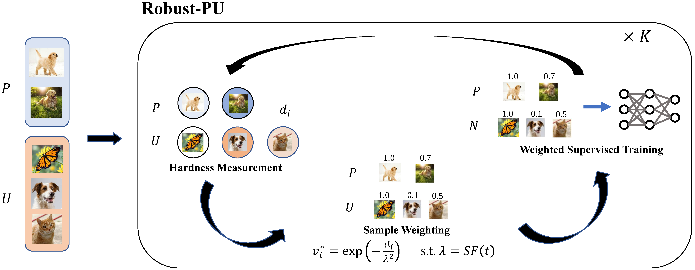

# Robust Positive-Unlabeled Learning via Self-selection of Unlabeled Negatives
This repo contains the official **PyTorch** code for Robust-PU.

## Introduction



We utilize a novel "hardness" measure to distinguish unlabeled samples with a high chance of being negative from unlabeled samples with large label noise. An iterative training strategy is then implemented to fine-tune the selection of negative samples during the training process in an iterative manner to include more "easy" samples in the early stage of training.

## Usage

### Requirements

Python 3.9

1. ```bash
   conda install pytorch torchvision torchaudio cudatoolkit=11.3 -c pytorch
   ```

2. ```bash
   pip install -r requirements.txt
   ```

### Experiments